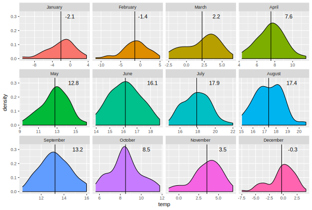

# Wstęp do metod badań geograficznych

1. Instalacja pakietu
--------------------
W celu zainstalowania pakietu najszybciej wykorzystać pakiet `devtools` oraz pakiety na których bazuje `wstepdometod`:

``` r
# dla swiezej instalacji R:
install.packages("devtools")
install.packages("ggplot2")
install.packages("reshape")
install.packages("plyr")
install.packages("dplyr")
install.packages("tidyverse")
install.packages("RColorBrewer")
library(devtools)
install_github("bczernecki/wstepdometod")
```


2. Skrypty robocze do wizualizacji i przetwarzania danych
--------------------


Wykresy pudełkowe dla percentyli: 0.05, 0.25, 0.50, 0.75, 0.95 oraz 1- i 2.5-odchylenia standardowego


Rozkłady anomalii


Wartości rzeczywiste z zaznaczonymi wartościami średnimi w wieloleciu
