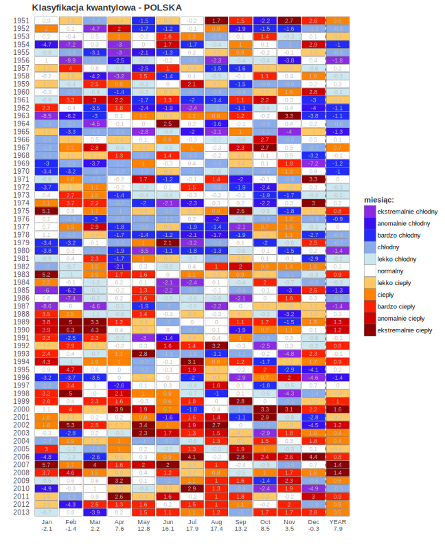

# Wstęp do metod badań geograficznych

Skrypty robocze do wizualizacji i przetwarzania danych

Wykresy pudełkowe dla percentyli: 0.05, 0.25, 0.50, 0.75, 0.95 oraz 1- i 2.5-odchylenia standardowego

Rozkłady anomalii

Wartości rzeczywiste z zaznaczonymi wartościami średnimi w wieloleciu
